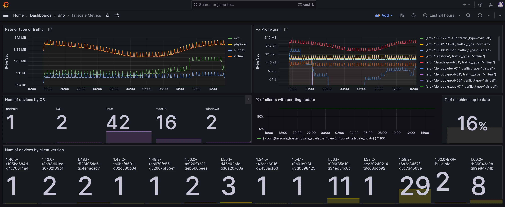

# Tailscale metrics

This tool exposes [tailscale](https://tailscale.com/) [API data](https://tailscale.com/kb/1219/network-flow-logs#network-logs-structure) as []prometheus(https://prometheus.io/docs/introduction/overview/) metrics.

  

